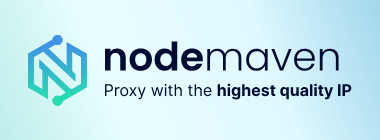

<div align="center">


### Self-hosted operators for website extraction, search, and agent workflows powered by Headfox JS and Camoufox

[](docs/setup-guide.md)
[](https://nodejs.org/)
[](https://nextjs.org/)
[](LICENSE)

[Setup Guide](https://headlessx.saify.me/docs/self-hosting/overview) • [API Reference](https://headlessx.saify.me/docs/api-reference/overview) • [MCP](https://headlessx.saify.me/docs/get-started/mcp-setup)

</div>

---

<div align="center">


</div>

## Overview

HeadlessX is a self-hosted scraping platform with a web dashboard, protected API, queue-backed workflows, and a remote MCP endpoint.

Current live operator surfaces:

- Website operator: scrape, crawl, map, content extraction, screenshots
- Google AI Search
- Tavily
- Exa
- YouTube
- Queue jobs, logs, API keys, proxy management, and config management
- Remote MCP over `/mcp`

Important operator setup notes:

- Google AI Search requires a one-time `Build Cookies` run in the dashboard before the first search
- the saved Google session is kept in the shared persistent browser profile and reused later
- the YouTube workspace is active only when `YT_ENGINE_URL` points at a healthy `yt-engine` service

## What Changed In v2.1.2

- Added the published HeadlessX CLI bootstrap flow with `headlessx init`, `start`, `logs`, `stop`, `restart`, `status`, and `doctor`
- Upgraded the CLI prompt UX with guided modern setup and login prompts
- Added Docker plus Caddy production domain scaffolding under `infra/domain-setup`
- Moved local and Docker host defaults to rarer ports to avoid conflicts with common `3000` and `8000` stacks
- Refreshed setup, CLI, and self-hosting docs around the current operator-first platform layout

## Sponsors

<details open>
<summary>View</summary>

<table>
  <tr>
    <td width="440" align="center" valign="middle">
      <a href="https://birdproxies.com/t/headlessx">
        
      </a>
    </td>
    <td valign="top">
      Hey, we built <a href="https://birdproxies.com/t/headlessx">BirdProxies</a> because proxies shouldn't be complicated or overpriced. Fast residential and ISP proxies in 195+ locations, fair pricing, and real support. Try our FlappyBird game on the landing page for free data!
      <br />
      <a href="https://birdproxies.com/t/headlessx"><strong>Try BirdProxies now</strong></a> &nbsp;|&nbsp; <a href="https://discord.com/invite/birdproxies"><strong>Join the Discord</strong></a>
    </td>
  </tr>
  <tr>
    <td width="440" align="center" valign="middle">
      <a href="https://www.swiftproxy.net/?ref=HeadlessX">
        
      </a>
    </td>
    <td valign="top">
      <strong>Swiftproxy</strong> — Reliable residential proxies optimized for HeadlessX automation and anti-bot workflows. Access 80M+ rotating residential IPs across 190+ countries with non-expiring traffic, high anonymity, sticky sessions, and free trials. Get 10% off with code <strong>PROXY90</strong>.
      <br />
      <a href="https://www.swiftproxy.net/?ref=HeadlessX"><strong>Try Swiftproxy now</strong></a> &nbsp;|&nbsp; <a href="https://t.me/Swiftproxy_Support"><strong>Contact us</strong></a>
    </td>
  </tr>
  <tr>
    <td width="440" align="center" valign="middle">
      <a href="https://go.nodemaven.com/Saifyxproreadme">
        
      </a>
    </td>
    <td valign="top">
      <strong>NodeMaven</strong> — The most reliable proxy provider with the highest quality IP on the market. Best for automation, web scraping, SEO research, and social media management. 99.9% uptime, sticky sessions up to 7 days, fraud score &lt;97%, no KYC. Use <strong>HEADLESSX35</strong> for 35% off Mobile/Residential or <strong>HEADLESSX40</strong> for 40% off ISP proxies.
      <br />
      <a href="https://go.nodemaven.com/Saifyxproreadme"><strong>Try NodeMaven now</strong></a>
    </td>
  </tr>
</table>

</details>

## Operators

<div align="center">


</div>

### Coming Soon

| Operator | Description | Status |
| --- | --- | --- |
| Google Maps | Extract business listings, reviews, categories, ratings, contact details, opening hours, and location metadata from Google Maps search results. | Planned |
| Twitter / X | Capture profiles, posts, engagement metrics, media, hashtags, and conversation threads from public X pages. | Planned |
| LinkedIn | Extract public company and profile data, role details, locations, website links, and business metadata from LinkedIn surfaces. | Planned |
| Instagram | Collect public profile data, captions, post metadata, media links, reels references, and engagement signals. | Planned |
| Amazon | Extract product listings, seller data, pricing, ratings, reviews, availability, and catalog metadata from Amazon pages. | Planned |
| Facebook | Capture public page data, posts, about fields, links, follower counts, and engagement metadata from Facebook pages. | Planned |
| Reddit | Extract subreddit, post, comment, author, score, flair, and discussion metadata from Reddit threads and listings. | Planned |
| ThomasNet Suppliers Real-Time Scraper | Extract 70+ ThomasNet supplier fields including emails, phone numbers, company data, products, locations, certifications, and more. | Planned |
| TLS Appointment Booker | Automate TLS appointment availability checks and booking workflows with support for high-frequency monitoring and retry-safe session handling. | Planned |
| GlobalSpec Suppliers Scraper | Extract 200,000+ industrial supplier profiles from GlobalSpec Engineering360 with contact data, business type, product catalogs, specs, and datasheets. | Planned |
| ImportYeti Scraper | Extract supplier profiles, shipment records, and trade data from ImportYeti with 60+ fields including HS codes, shipping lanes, carriers, bills of lading, trading partners, and contact info. | Planned |
| MakersRow Scraper | Extract 11,600+ US manufacturer profiles from MakersRow with email, phone, address, website, GPS coordinates, capabilities, ratings, gallery images, and business hours. | Planned |

## Agent Surfaces Coming Soon

| Surface | Description | Status |
| --- | --- | --- |
| Web AI Agent (`/web`) | Interactive AI agent workspace inside the dashboard that can use all HeadlessX operators and related workflow actions, including Website, Google AI Search, Tavily, Exa, and YouTube. | Planned |

## Agent Skills

Install the owner-fork CLI skill in agents that support the `skills` installer:

```bash
npx skills add https://github.com/unreasonablygood/headlessx --skill cli
```

The skill covers the published user-managed CLI. It deliberately distinguishes
that API-key workflow from the owner-installed fixed Tailnet client.

## UI Screenshots

### Google AI Search (Recently Tested with Arabic Lang & Region)


### Website


## Proof

### BrowserScan


<details>
<summary>Cloudflare Challenge</summary>


</details>

<table>
  <tr>
    <td valign="top" width="50%">

### Pixelscan


  </td>
    <td valign="top" width="50%">

### Proxy Validation


  </td>
  </tr>
</table>

## Quick Start

### System Requirements

| Item | Minimum | Recommended |
| --- | --- | --- |
| OS | macOS, Linux, or Windows 11 with WSL2 | Ubuntu 22.04+/24.04, Debian 12, or Windows 11 with WSL2 |
| CPU | 2 cores | 4+ cores |
| RAM | 4 GB | 8-16 GB |
| Disk | 10 GB free | 20+ GB SSD |
| Network | outbound internet for installs, browser downloads, and APIs | stable broadband |

### Runtime dependencies

- Node.js 22+ and pnpm 10.32.1+ for repository development
- Git
- PostgreSQL and Redis reachable for developer mode
- Python/uv for `yt-engine`
- Go for the HTML-to-Markdown sidecar
- Docker Engine with Compose v2 for `self-host` and `production`; Docker is
  optional for developer mode when PostgreSQL and Redis are provided another
  way

If your machine does not already use the pinned pnpm release, align it with:

```bash
corepack enable
corepack use pnpm@10.32.1
```

### Practical Sizing Notes

- 4 GB RAM is enough for light local testing
- 8 GB RAM is the better baseline for the web, API, worker, Redis, and browser runtime together
- 16 GB RAM is safer for heavier crawl jobs, YouTube flows, or multiple concurrent browser tasks

### CLI Bootstrap

HeadlessX is now CLI-first for installation and local lifecycle management.

```bash
npm install -g @headlessx-cli/core
headlessx init
headlessx status
headlessx doctor
```

The CLI bootstraps the owner fork into `~/.headlessx` by default and supports
three setup modes:

- `developer`: run app processes locally with non-production credentials in the
  root `.env`; Docker is optional infrastructure
- `self-host`: run the full stack with Docker and fixed private credential
  sources under `~/.headlessx/repo/infra/docker/secrets`
- `production`: run the same credential-file-backed app stack plus Caddy for
  `dashboard.yourdomain.com` and `api.yourdomain.com`; Caddy protects the
  dashboard with a separate operator username and password

Useful examples:

```bash
headlessx init --mode developer
headlessx init --mode self-host
headlessx init --mode production --api-domain api.example.com --web-domain dashboard.example.com --caddy-email ops@example.com
headlessx init update
headlessx start
headlessx logs
headlessx restart
headlessx stop
```

Production init masked-prompts for the dashboard password and stores only a
Caddy bcrypt verifier. For unattended setup, supply a precomputed verifier
with `--dashboard-password-hash`; there is deliberately no plaintext-password
flag.

For existing CLI-managed installs, `headlessx init update` pulls the configured
branch into `~/.headlessx/repo`, reconciles non-secret mode configuration,
migrates legacy Compose credentials into fixed private files, and refreshes the
generated Caddy policy. It never prints credential values, writes the
dashboard password, or writes fixed app credentials back to `.env`. An
incomplete app credential set or invalid dashboard verifier is refused; a
missing verifier prompts interactively and fails closed in unattended use.

For `self-host` and `production`, `headlessx restart` rebuilds Docker images
before bringing the stack back up.

Compose binds its uncommon host ports to `127.0.0.1` by default:
`web=34872`, `api=38473`, `postgres=35432`, `redis=36379`,
`html-to-md=38081`, and `yt-engine=38090`. Self-host users can explicitly set a
non-loopback IPv4 address with `--host-bind`, but the CLI warns because that
also publishes the unauthenticated dashboard and data services. Production
core ports stay loopback-only; public web/API traffic reaches them through the
shared Caddy Docker network.

For deeper setup details, direct repo development, env files, Docker internals, and MCP/client notes, see [docs/setup-guide.md](docs/setup-guide.md).

### Google AI Search First Run

The first Google AI Search run now uses a shared persistent browser profile instead of a seeded browser profile committed into the repo.

1. Open `/playground/operators/google/ai-search`
2. Click `Build Cookies`
3. Let the shared browser open Google
4. Browse normally and solve any Google or reCAPTCHA prompt once
5. Click `Stop Browser` to save the profile

After that, the saved shared profile is reused for later Google searches.

- Docker and VPS installs persist it in the `browser_profile` volume
- local repo runs persist it under `apps/api/data/browser-profile/default`
- the old tracked `apps/api/default-data/browser-profile` bundle has been removed

### YouTube Workspace

The YouTube operator is live only when `YT_ENGINE_URL` is configured.

- CLI `self-host` and `production` init flows write it automatically
- custom local setups must point `YT_ENGINE_URL` at a reachable `yt-engine` instance

## API summary

Ordinary non-health routes use `x-api-key` with a user-created key or the
dashboard's internal key. The fixed public-page scrape and evidence routes
additionally admit the two compiled trusted-seat Tailnet identities without a
bearer; the WebDocument identity requires its dedicated fixed evidence
credential. This exception belongs to the owner-operated direct service, not
published CLI login.

CLI-managed Compose copies the four fixed credential sources into root-owned
`0400` runtime volumes. The owner API-only production path instead mounts
root-owned files from `/etc/headlessx/credentials/current` through
`docker-compose.fleet.yml`. Those credentials never fall back to values in
`.env` or Coolify environment rows. See
[the production runbook](docs/runbooks/headlessx.md).

On CLI-managed production hosts, the public dashboard domain first requires
Caddy Basic Auth. Caddy removes that `Authorization` header before proxying to
the web app. The public API domain does not use the dashboard password: its
non-health routes keep the ordinary `x-api-key` contract.

Core backend surfaces:

- `GET /api/health`
- `GET/PATCH /api/config`
- `GET /api/dashboard/stats`
- `GET /api/logs`
- `GET/POST/PATCH/DELETE /api/keys`
- proxy CRUD under `/api/proxies`
- website operator routes under `/api/operators/website/*`
- Google AI Search routes under `/api/operators/google/ai-search/*`
- Tavily routes under `/api/operators/tavily/*`
- Exa routes under `/api/operators/exa/*`
- YouTube routes under `/api/operators/youtube/*`
- queue job routes under `/api/jobs/*`
- remote MCP endpoint at `/mcp`

See the full route reference in [docs/api-endpoints.md](docs/api-endpoints.md).

## MCP

HeadlessX exposes a remote MCP endpoint from the API:

```text
http://localhost:38473/mcp
```

Use a normal API key created from the dashboard API Keys page.

Do not use `DASHBOARD_INTERNAL_API_KEY` for MCP clients.

Example client config:

```json
{
  "mcpServers": {
    "headlessx": {
      "transport": "http",
      "url": "http://localhost:38473/mcp",
      "headers": {
        "x-api-key": "hx_your_dashboard_created_key"
      }
    }
  }
}
```

## Monorepo Layout

```text
apps/
  api/                    Express API + worker + MCP
  web/                    Next.js dashboard
  yt-engine/              Python YouTube engine
  go-html-to-md-service/  Go HTML-to-Markdown sidecar
docs/
  setup-guide.md
  api-endpoints.md
infra/docker/
```

## Packages

| Package | Description | Status |
| --- | --- | --- |
| @headlessx-cli/core | Published CLI package for HeadlessX operators, jobs, and search workflows. Command: `headlessx` | Available |
| HeadlessX Agent Skills | Installable agent skill pack from this repository for Cursor, Claude Code, Warp, Windsurf, OpenCode, OpenClaw, Antigravity, and similar tools. | Available |

### Available

| Package | Description | Status |
| --- | --- | --- |
| headfox-js | Published TypeScript launcher and Playwright helper for Headfox, currently powered by Camoufox-compatible browser bundles. | Available |

### Coming Soon

| Package | Description | Status |
| --- | --- | --- |
| headfox | HeadlessX-maintained Firefox-based anti-detect browser engine that will power the platform's next-generation browser runtime. | Planned |

## Notes

- The dashboard uses its internal API key only for server-side requests;
  production reads the fixed mounted file rather than an environment
  credential.
- Public production dashboard browsers first pass the separate Caddy Basic
  Auth boundary; Caddy never forwards that `Authorization` header upstream.
- MCP, the public API domain, and the published CLI use normal user-created API
  keys, never the dashboard internal or fixed evidence key.
- Queue-backed features return degraded/unavailable behavior when Redis is missing.
- Docker support covers the full runtime stack, including yt-engine.

## Contributing

See [CONTRIBUTING.md](CONTRIBUTING.md) for the current contribution workflow, local setup expectations, pull request guidance, and commit message conventions.

## License

MIT
